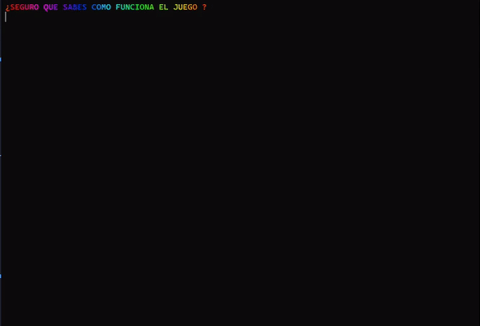

<h1 align="center" >
<span style="color:#ABC9FF">C</span>
    <span style="color:#FF8B8B">L</span>
    <span style="color:#ADCF9F">I</span>
    <span style="color:#293462">-</span>
    <span style="color:#FFDEB4">G</span>
    <span style="color:#B1E1FF">A</span>
    <span style="color:#8FE3CF">M</span>
    <span style="color:#FFB3B3">E</span>
</h1>

>                     Juego de preguntas con interfaz de línea de comandos.

## Install

```sh
npm install
```

**Resultado:**

